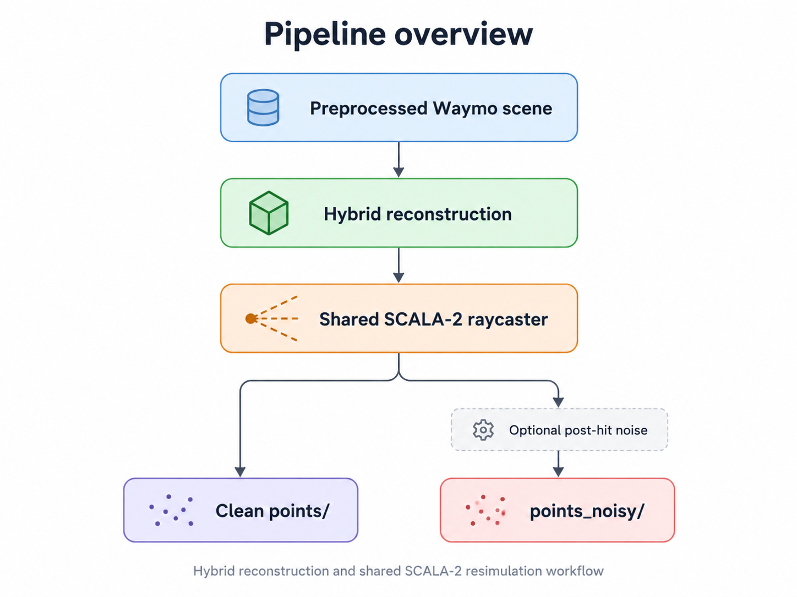

# Semantic-aware Waymo surface reconstruction + SCALA-2 resimulation

Layout for the hybrid semantic reconstruction and the SCALA-2 raycaster.

## Design


The original MLS raycaster is retained under `archive/old_raycaster/` for reproducibility.

## Main commands

Build PCL once:

```bash
./scripts/build_pcl_mls.sh
```

One scene, reconstruction + raycast:

```bash
python pipeline.py scene <CASEID>
```

Several scenes:

```bash
python pipeline.py list --split-file scenes.txt
```

Reconstruction only:

```bash
python pipeline.py scene <CASEID> --stage reconstruct
```

Raycast only when reconstruction already exists:

```bash
python pipeline.py scene <CASEID> --stage raycast
```

Add noise to existing clean raycasts without reraycasting:

```bash
python pipeline.py noise <CASEID>
```

Noise ablations:

```bash
python pipeline.py ablation <CASEID>
```

Runtime defaults come from `configs/baseline_default.json`. CLI arguments override the config for a single run.

See `docs/USAGE.md`, `docs/ARCHITECTURE.md`, and `docs/NOISE.md`.
